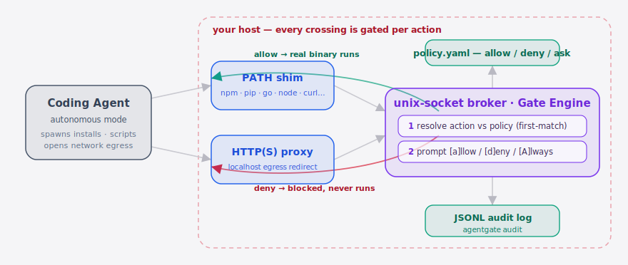
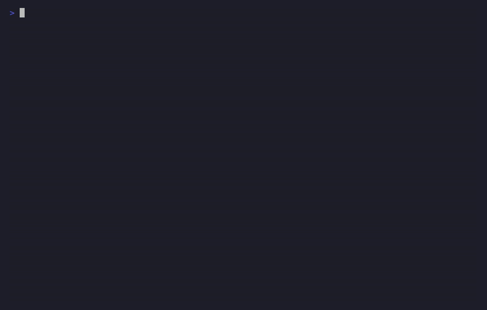

<p align="center">
  
</p>

<p align="center">
  <b>The runtime host guard that approves your coding agent's every install, script, and network call — per action, not all-or-nothing.</b>
</p>

<p align="center">
  <a href="./LICENSE"></a>
  <a href="https://github.com/SuperMarioYL/agentgate/releases"></a>
  <a href="https://github.com/SuperMarioYL/agentgate/actions"></a>
  <a href="https://go.dev/"></a>
  
  
</p>

<p align="center">
  <b>English</b> | <a href="./README.md">简体中文</a>
</p>

---

**You put a Coding Agent into autonomous mode to pull deps and run scripts — but containers are all-or-nothing, and the moment you disable one for productivity your host is wide open. AgentGate intercepts each host-touching action the instant it happens and asks you, carrying the agent's own intent: allow it or deny it?**

## Table of contents

- [Why this exists](#why-this-exists)
- [Quickstart](#quickstart)
- [Demo](#demo)
- [The policy.yaml DSL](#the-policyyaml-dsl)
- [Configuration](#configuration)
- [Comparison](#comparison-vs-containers--static-scanners)
- [Roadmap](#roadmap)
- [License](#license)

## Why this exists

When you let a **Coding Agent** write code, pull dependencies, and run scripts, you delegate trust while keeping the responsibility — and there is no scoped checkpoint between you and the host. Containers do isolation, but they are all-or-nothing, so developers disable them for agent productivity; even when running, a container can't tell "this install is fine" from "that network call is exfiltration."

This is **not** a static dependency scanner. Supply-chain worms like Miasma target AI coding agents specifically — Miasma disabled 72+ repositories (including Microsoft's Azure Functions Action), and its payload only reveals itself at install / exec time, where static analysis reading the package beforehand never sees it. AgentGate is a **runtime, per-action** guard: it authorizes each install, script, and egress as it happens, so a supply-chain payload is stopped at execution instead of discovered after 72 repos go down.

> This is the trust-vs-control gap [@simonw](https://twitter.com/simonw) keeps flagging when agents run shell commands, and the missing piece for the autonomy-maximizing coding-agent harnesses (e.g. [affaan-m/ECC](https://github.com/affaan-m/ECC)) that ship no host gate at all — AgentGate is complementary to them, not a competitor.

##  Architecture

<p align="center">
  <picture>
    <source media="(prefers-color-scheme: dark)" srcset="./assets/atlas-dark.svg">
    <source media="(prefers-color-scheme: light)" srcset="./assets/atlas-light.svg">
    
  </picture>
</p>

The coding agent runs behind the gate: every subprocess it spawns is caught by a **PATH shim**, and every network call is redirected through an injected **HTTP(S) proxy**. Both paths converge on a single **unix-socket broker / Gate Engine** that resolves each action against `policy.yaml` first-match-wins — prompting `[a]llow / [d]eny / [A]lways` when needed. An allowed action `exec`s the real binary and proceeds; a denied one never lands. Every verdict is appended to a **JSONL audit log** you can replay with `agentgate audit`.

## Quickstart

Requires Go 1.24+ (Linux or macOS). Three commands from a cold start to your first prompt:

```bash
go install github.com/SuperMarioYL/agentgate@latest   # 1. install the single binary
agentgate init                                         # 2. drop a default policy.yaml here
agentgate run -- claude --autonomous "add a chart library and wire it up"  # 3. run your agent behind the gate
```

The first host-touching action pauses and shows the agent's own intent:

```
┌─ AgentGate · action paused ──────────────────
│ agent  : claude-code
│ action : exec
│ target : npm install chalk
│ intent : agent wants to install npm package: chalk
└──────────────────────────────────────────────
  [a]llow / [d]eny / [A]lways ?
```

Press `a` to allow once, `d` to deny, `A` to always allow (this writes a rule back into `policy.yaml`, so steady state is near-silent). Afterwards, `agentgate audit` prints the JSONL trail of every gated action:

```bash
agentgate audit
# ✓  13:20:26  exec        allow    npm install chalk
# ✗  13:20:26  net_egress  deny     telemetry.unknown-host.example

# Just show "what got blocked?" — filter by decision / action / time (v0.3.0)
agentgate audit --decision deny
agentgate audit --action net_egress --since 2h
agentgate audit --decision deny --json   # raw JSONL passthrough for piping
```

> `--since` accepts an RFC3339 timestamp, a date (`2026-06-19`), or a duration ago (`2h`, `30m`).

> Interception is portable and ptrace/libpcap-free: a PATH shim forwards each intercepted command to a unix-socket broker that owns the gate decision, and network egress is gated per host through a localhost redirect proxy wired in via `HTTP(S)_PROXY`. See [`examples/claude-code-session.md`](./examples/claude-code-session.md) for the full walkthrough.

##  Demo

An agent's `npm install` is paused for approval, a post-install egress to an undeclared host is blocked in red, and `agentgate audit` prints the full trail:



> The GIF is rendered in CI from [`docs/demo.tape`](./docs/demo.tape) via [vhs](https://github.com/charmbracelet/vhs) (see [`.github/workflows/demo.yml`](./.github/workflows/demo.yml)). A recorded [`docs/demo.cast`](./docs/demo.cast) also ships in this repo — replay it locally with `asciinema play docs/demo.cast`.

## The policy.yaml DSL

A policy is an **ordered, first-match-wins** list of rules. Each rule has a `match` (`action` + `target_glob`) and a `decision` (`allow` / `deny` / `ask`); anything no rule matches falls through to `default`.

```yaml
default: ask                 # fallback when no rule matches

rules:
  # exec — installs and scripts the agent spawns
  - match:
      action: exec
      target_glob: "*install*"
    decision: ask            # surface every install so you see what gets pulled

  # fs_write — confine writes to the project directory
  - match:
      action: fs_write
      target_glob: "$PWD/**"
    decision: allow
    scope: "$PWD"            # writes must stay under the project root
  - match:
      action: fs_write
    decision: deny           # any write outside the project root is denied

  # net_egress — allow common registries, gate everything else
  - match:
      action: net_egress
      target_glob: "registry.npmjs.org"
    decision: allow
  - match:
      action: net_egress
    decision: deny           # undeclared host -> blocked
```

Glob semantics: `*` matches a single path/host segment (`filepath.Match` semantics), `**` matches across segments (e.g. `$PWD/**`); a `**` pattern with a suffix (e.g. `/proj/**.env`) requires the target to *end* with that suffix and will not match it as a mid-string substring (so `/proj/.env.backup/passwd` is not waved through by `/proj/**.env`). A bare host token with no wildcard matches on a **host boundary** — the whole target, or the host part of a `host:port` target (so `registry.npmjs.org` matches `registry.npmjs.org:443`), but it will **not** wave through look-alike hosts such as `github.com.evil.com` or `evilgithub.com`. A leading-dot token (e.g. `.github.com`) matches the whole subdomain tree (`api.github.com`) but not the bare apex `github.com` itself. `agentgate init` drops a sensible built-in default policy you can edit.

### Dry-run first: `agentgate check`

Wrote a policy and want to know how it resolves a given action *before* trusting an agent to it? `agentgate check` runs a hypothetical action against the policy and prints the decision (`allow` / `deny` / `ask`) plus why — **without running any subprocess, dialing any host, or writing to the audit log.**

```bash
agentgate check --action exec -- npm install left-pad
# action  : exec
# target  : npm install left-pad
# intent  : agent wants to install npm package: left-pad
# decision: ask (matched a rule)

agentgate check --action net_egress github.com.evil.com:443
# decision: deny (no rule matched, fell through to default)

agentgate check --action fs_write /etc/passwd
# decision: deny (matched an allow rule but the path escapes its scope)
```

`--action` takes `exec` (default) / `fs_write` / `net_egress`; `--policy` selects the file to check.

## Configuration

Common `agentgate run` flags:

| Flag | Type | Default | Meaning |
| --- | --- | --- | --- |
| `--policy` | string | `./policy.yaml` (or `$AGENTGATE_POLICY`) | policy file to use |
| `--audit` | string | `.agentgate/audit.jsonl` (or `$AGENTGATE_AUDIT`) | append-only JSONL audit log path |
| `--agent` | string | `claude-code` | identifier for the wrapped agent (shown in prompt + audit) |
| `--no-net` | bool | `false` | disable the network egress gate (gate exec / fs only) |
| `--always` | bool | `true` | persist `[A]lways` choices back to the policy file |
| `--enforce` | bool | `false` | headless CI mode: no prompts, every `ask` resolves to `deny` (deny-by-default) |

### Run it in CI: `--enforce`

A CI pipeline has no operator to answer a prompt. `agentgate run --enforce` starts the engine with no prompter — every `ask` falls to `deny` (deny-by-default) and the run **never waits on a TTY**:

```bash
agentgate run --enforce -- npm ci
# agentgate: --enforce (headless): no prompts, ask resolves to deny (deny-by-default)
```

Only actions the policy **explicitly `allow`s** proceed; everything else is blocked and recorded to the audit trail. `--always` persistence is disabled in this mode (there is no operator to choose `[A]lways`).

## Comparison vs containers / static scanners

An honest read — containers are far more mature at isolation; AgentGate solves a different problem: **per-action, intent-aware, at runtime.**

| Axis | AgentGate | Container / disposable VM | Static dependency scanner |
| --- | --- | --- | --- |
| Per-action authorization | ✓ | ✗ (all-or-nothing) | ✗ |
| Carries the agent's intent | ✓ | ✗ | ✗ |
| Catches payload at runtime | ✓ | partial (no per-action distinction inside the boundary) | ✗ (reads the package pre-install, misses runtime payloads) |
| Mature process isolation | partial (spawn + egress boundary) | ✓ | — |
| Stays on instead of being disabled for speed | ✓ | ✗ (often disabled because it slows the agent) | — |

## Roadmap

- [x] **m1 — wrap & gate exec**: wrap an agent, intercept each subprocess it spawns, prompt allow/deny with the captured intent.
- [x] **m2 — scope fs & net**: a `policy.yaml` confines filesystem writes to declared paths and gates egress per host, with a JSONL audit log.
- [x] **m3 — DSL & demo**: the `allow`/`deny`/`ask` DSL + `--always` persistence, an `agentgate init` default policy, a 60s asciinema demo, and the bilingual README.
- [x] **m4 — author & audit a policy**: `agentgate check` dry-runs any action against the policy, host-boundary egress matching closes the look-alike-host bypass, and `.host` tokens scope rules to a subdomain tree.
- [x] **m5 — CI & triage**: `agentgate run --enforce` for unattended default-deny (no more blocking on a TTY in CI); `agentgate audit` gains `--decision` / `--action` / `--since` filters and `--json` output; plus two sandbox fixes — a symlink-escape write bypass and a `**` path-glob substring over-match.
- [ ] Drop-in adapters and README safety-section integration for more harnesses (ECC / openfang).
- [ ] A policy cookbook: ready-to-use policies that catch real supply-chain behavior.
- [ ] Team-shared policies / audit dashboard (a v2+ exploration, not the current thesis).

> After pushing, set GitHub topics: `gh repo edit --add-topic agent --add-topic coding-agent --add-topic security --add-topic sandbox`

## License

AgentGate is free, MIT-licensed, single-binary OSS — no paywall, no hosted tier. File an [issue](https://github.com/SuperMarioYL/agentgate/issues) or open a PR to contribute.

## Share this

```
AgentGate — a runtime per-action host gate for your Coding Agent. It pauses each
install / script / egress with the agent's own intent, instead of all-or-nothing
containers. After the Miasma worm, your agent needs a seatbelt.
https://github.com/SuperMarioYL/agentgate
```

<p align="center"><sub><a href="./LICENSE">MIT</a> © 2026 SuperMarioYL</sub></p>
